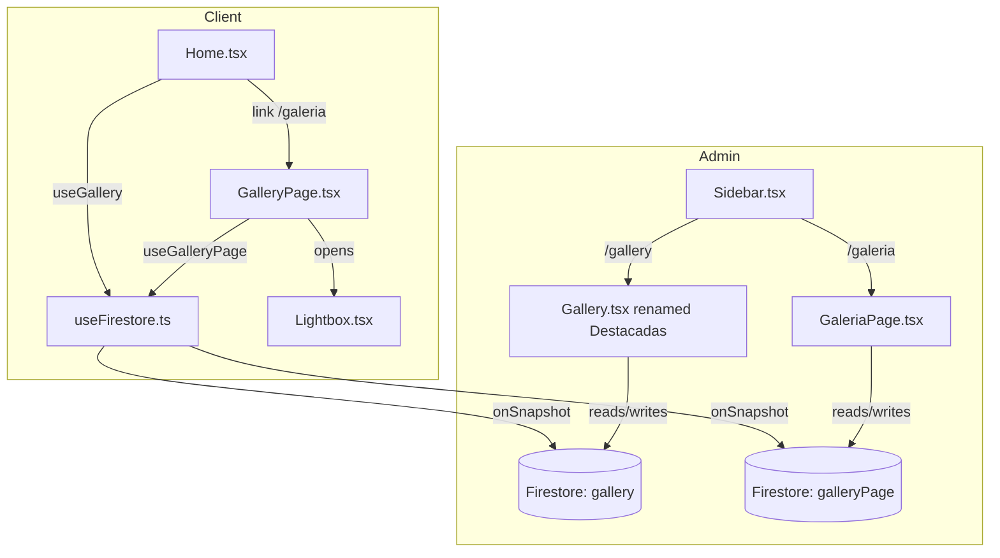

# Design Document: gallery-page

## Overview

Se añade una página pública `/galeria` al portfolio de Mery Palencia que muestra todas las ilustraciones de una nueva colección Firestore `galleryPage`. La página usa el Lightbox slider ya existente y un grid responsive de 2-3 columnas. Paralelamente, el admin recibe una nueva sección "Galería" para gestionar `galleryPage`, y la sección existente se renombra a "Destacadas". El Home recibe un botón "Ver Galería" en header y hero.

El diseño reutiliza al máximo el código existente: el hook `useGallery` se replica como `useGalleryPage`, el componente `Gallery.tsx` del admin se duplica como `GaleriaPage.tsx` con mínimos cambios, y el `Lightbox` se usa sin modificaciones.

## Architecture



**Decisiones de diseño:**
- `galleryPage` es una colección Firestore independiente de `gallery`. Esto evita contaminar las "Destacadas" del Home con todas las ilustraciones de la galería completa.
- `GaleriaPage.tsx` (admin) es una copia de `Gallery.tsx` apuntando a `galleryPage`. Se prefiere duplicar sobre parametrizar para mantener cada sección independiente y evitar complejidad innecesaria.
- El routing del client usa wouter (ya existente); el del admin usa react-router-dom (ya existente).

## Components and Interfaces

### Client

**`useGalleryPage` hook** (`client/src/hooks/useFirestore.ts`)
- Replica `useGallery` apuntando a la colección `galleryPage`
- Normaliza `extraImages` a `[]` si el campo no existe

**`GalleryPage` component** (`client/src/pages/GalleryPage.tsx`)
- Consume `useGalleryPage`
- Renderiza grid 2 cols (mobile) / 3 cols (desktop) con Tailwind
- Al click en una tarjeta abre `Lightbox` con los datos del item
- Header idéntico al de `Home.tsx`: logo, link Blog, link Galería (activo), ThemeToggle
- Estado vacío: mensaje placeholder

**`Home.tsx` — cambios mínimos**
- Header: añadir link "Ver Galería" → `/galeria` junto al link "Blog"
- Hero buttons: añadir `<Button>` "Ver Galería" → `window.location.href = '/galeria'`

**`client/src/App.tsx`**
- Añadir `<Route path="/galeria" component={GalleryPage} />`

### Admin

**`Gallery.tsx`** — cambios de etiquetas únicamente
- Heading: "Destacadas"
- Subtitle: "Imágenes del carrusel del Home"
- Sin cambios en lógica ni colección Firestore

**`GaleriaPage.tsx`** (`admin/src/pages/GaleriaPage.tsx`)
- Copia de `Gallery.tsx` con colección `galleryPage`
- Heading: "Galería"
- Subtitle: "Ilustraciones de la página /galeria"
- Misma lógica de CRUD, upload a Cloudinary, extraImages (máx 4)

**`Sidebar.tsx`** — cambios en `NAV_ITEMS`
- `/gallery` label: "Destacadas" (icono `Star` o mantener `Image`)
- Añadir `{ to: "/galeria", icon: GalleryHorizontal, label: "Galería" }` después de Destacadas

**`admin/src/App.tsx`**
- Añadir `<Route path="/galeria">` con `ProtectedRoute` + `GaleriaPage`

## Data Models

### GalleryItem (compartido entre `gallery` y `galleryPage`)

```typescript
interface GalleryItem {
  id: string;           // Firestore document ID
  title: string;        // Título de la ilustración
  image: string;        // URL Cloudinary de la imagen de portada
  publicId: string;     // Public ID de Cloudinary para la portada
  category: string;     // Una de: "personajes" | "escenarios" | "props" | "abstracto" | "otro"
  description: string;  // Descripción breve
  order: number;        // Posición en el grid (ascendente)
  extraImages?: {       // Imágenes adicionales para el slider (máx 4)
    url: string;
    publicId: string;
  }[];
}
```

Ambas colecciones (`gallery` y `galleryPage`) usan exactamente el mismo schema. No hay migración de datos: son colecciones independientes desde el inicio.

### Firestore collections

| Colección | Gestionada por | Consumida por |
|-----------|---------------|---------------|
| `gallery` | Admin /gallery (Destacadas) | Home.tsx carrusel |
| `galleryPage` | Admin /galeria (Galería) | Client /galeria page |

### Routing summary

| Path | App | Componente |
|------|-----|-----------|
| `/galeria` | Client | `GalleryPage` |
| `/gallery` | Admin | `Gallery` (Destacadas) |
| `/galeria` | Admin | `GaleriaPage` |

## Correctness Properties

*A property is a characteristic or behavior that should hold true across all valid executions of a system — essentially, a formal statement about what the system should do. Properties serve as the bridge between human-readable specifications and machine-verifiable correctness guarantees.*

### Property 1: Normalización de extraImages

*For any* documento de `galleryPage` que no tenga el campo `extraImages`, el hook `useGalleryPage` debe retornar ese item con `extraImages` igual a `[]`.

**Validates: Requirements 1.2**

---

### Property 2: Grid muestra todos los items

*For any* lista no vacía de `GalleryItem` retornada por `useGalleryPage`, el componente `GalleryPage` debe renderizar exactamente tantas tarjetas como items haya en la lista.

**Validates: Requirements 2.2**

---

### Property 3: Click en tarjeta abre Lightbox con datos correctos

*For any* item del grid, al hacer click sobre su tarjeta, el `Lightbox` debe abrirse con `image`, `title`, `category`, `description` y `extraImages` iguales a los del item seleccionado.

**Validates: Requirements 2.3**

---

### Property 4: Validación máximo 4 imágenes extra

*For any* intento de agregar una imagen extra cuando ya existen 4 (entre `existingExtras` y `extraFiles`), el componente `GaleriaPage` debe rechazar el archivo y mostrar un mensaje de error, dejando el estado de imágenes sin cambios.

**Validates: Requirements 5.7**

---

### Property 5: Creación de documento en galleryPage

*For any* formulario válido (título no vacío, imagen de portada presente), al guardar en `GaleriaPage`, se debe crear un documento en la colección `galleryPage` con los campos `title`, `image`, `publicId`, `category`, `description`, `order` y `extraImages` correctamente almacenados.

**Validates: Requirements 5.3, 5.6**

---

### Property 6: Edición de documento en galleryPage

*For any* documento existente en `galleryPage` y cualquier modificación válida de sus campos, al guardar la edición en `GaleriaPage`, el documento debe reflejar los nuevos valores sin alterar otros documentos de la colección.

**Validates: Requirements 5.4**

---

### Property 7: Eliminación de documento en galleryPage

*For any* documento existente en `galleryPage`, al confirmar su eliminación en `GaleriaPage`, el documento debe desaparecer de la colección y no debe afectar a los demás documentos.

**Validates: Requirements 5.5**

---

### Property 8: Auth guard en admin /galeria

*For any* usuario no autenticado que intente acceder a `/galeria` en el admin, el sistema debe redirigir a `/login` sin renderizar `GaleriaPage`.

**Validates: Requirements 7.2**

---

## Error Handling

| Escenario | Comportamiento esperado |
|-----------|------------------------|
| Firestore no disponible al cargar `/galeria` | `useGalleryPage` mantiene `loading: true`; la UI puede mostrar un spinner o estado vacío sin crashear |
| Upload a Cloudinary falla al crear/editar en `GaleriaPage` | El `catch` del `handleSubmit` loguea el error; `saving` vuelve a `false`; el formulario permanece abierto para reintentar |
| Documento sin campo `image` en `galleryPage` | La tarjeta renderiza con `src` vacío (imagen rota); no crashea la página |
| Intento de agregar >4 imágenes extra | Se muestra `extrasError` y se rechaza el input; estado no cambia |
| Usuario no autenticado accede a `/galeria` admin | `ProtectedRoute` redirige a `/login` |
| Navegación directa a `/galeria` en client sin conexión | wouter renderiza `GalleryPage`; `useGalleryPage` retorna `loading: true` hasta que Firestore responda desde caché offline |

## Testing Strategy

### Enfoque dual: unit tests + property-based tests

Ambos tipos son complementarios y necesarios para cobertura completa.

**Unit tests** (ejemplos específicos y casos borde):
- Verificar que la ruta `/galeria` en el client renderiza `GalleryPage`
- Verificar que la ruta `/galeria` en el admin renderiza `GaleriaPage` (autenticado)
- Verificar que usuario no autenticado en `/galeria` admin es redirigido a `/login`
- Verificar que el header de `GalleryPage` contiene logo, link Blog, link Galería y ThemeToggle
- Verificar que con lista vacía se muestra el placeholder
- Verificar que el Sidebar muestra "Destacadas" para `/gallery` y "Galería" para `/galeria`
- Verificar que el heading de `Gallery.tsx` admin dice "Destacadas"
- Verificar que `Home.tsx` header contiene link "Ver Galería" → `/galeria`
- Verificar que `Home.tsx` hero contiene botón "Ver Galería" → `/galeria`

**Property-based tests** (propiedades universales):

Librería recomendada: **fast-check** (TypeScript, compatible con Vitest/Jest).

Cada test debe ejecutarse con mínimo **100 iteraciones**.

Cada test debe incluir un comentario con el tag:
`// Feature: gallery-page, Property N: <texto de la propiedad>`

| Property | Test |
|----------|------|
| P1: Normalización extraImages | Generar docs con/sin `extraImages`; verificar que `useGalleryPage` siempre retorna `extraImages: []` cuando falta |
| P2: Grid muestra todos los items | Generar listas de 1-50 GalleryItems; renderizar `GalleryPage`; contar tarjetas === items.length |
| P3: Click abre Lightbox con datos correctos | Generar lista de items; seleccionar uno aleatorio; simular click; verificar props del Lightbox |
| P4: Validación máx 4 extras | Generar estados con 4 extras ya presentes; intentar agregar 1 más; verificar rechazo y mensaje de error |
| P5: Creación en galleryPage | Generar inputs válidos; mockear Firestore; verificar que `addDoc` recibe los campos correctos |
| P6: Edición en galleryPage | Generar item existente + edición válida; mockear Firestore; verificar que `updateDoc` recibe los campos correctos |
| P7: Eliminación en galleryPage | Generar item existente; mockear Firestore; verificar que `deleteDoc` es llamado con el ID correcto |
| P8: Auth guard | Generar estado no autenticado; navegar a `/galeria` admin; verificar redirect a `/login` |
