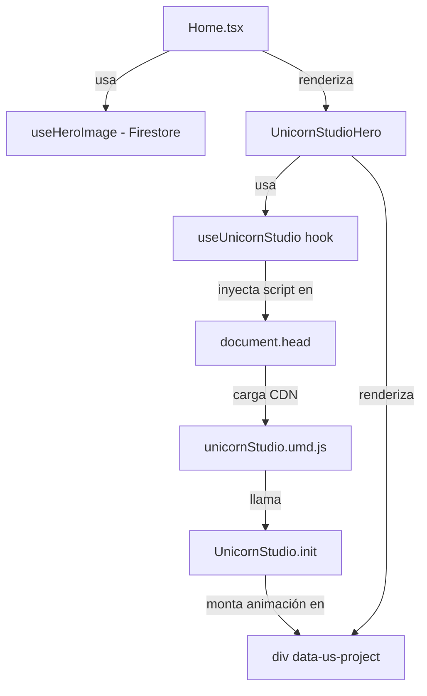

# Design Document: UnicornStudio Hero Integration

## Overview

Este diseño describe la integración del widget animado de UnicornStudio como hero principal del portafolio de Mery Palencia. El objetivo es reemplazar la imagen estática del hero por una animación interactiva cargada desde CDN, manteniendo toda la funcionalidad existente de Firestore, el layout responsivo y el sistema de diseño actual.

La integración se divide en tres piezas:
1. Un hook (`useUnicornStudio`) que gestiona la inyección del script de CDN de forma segura en el contexto de una SPA.
2. Un componente (`UnicornStudioHero`) que encapsula el widget y su estado de carga.
3. Una modificación mínima de `Home.tsx` para sustituir la columna de imagen por el nuevo componente.

**Decisiones de diseño clave:**
- El script se inyecta una sola vez en el `<head>` usando una bandera en `window` para sobrevivir a navegaciones SPA sin duplicados.
- El hook expone un estado `ready` que el componente usa para mostrar un skeleton durante la carga.
- El widget mantiene la proporción nativa 390×844 (≈ 0.462) dentro de un contenedor con `overflow: hidden`, escalando con CSS para adaptarse a la columna del grid.
- El fallback ante fallo de CDN es un fondo de color sólido usando el token `--muted` del sistema de diseño, sin errores no capturados.
- `useHeroImage` se mantiene activo aunque su resultado no se use visualmente, preservando la suscripción Firestore.

---

## Architecture



**Flujo de carga:**
1. `UnicornStudioHero` se monta → llama a `useUnicornStudio`.
2. El hook verifica si el script ya existe en el DOM (por `src` o por `window.UnicornStudio`).
3. Si no existe: inyecta `<script>` en `<head>`, espera `onload`, llama `UnicornStudio.init()`, marca `ready = true`.
4. Si ya existe y está inicializado: llama `UnicornStudio.init()` directamente, marca `ready = true`.
5. Mientras `ready = false`: el componente muestra un skeleton.
6. Cuando `ready = true`: el skeleton desaparece y el widget ya está montado en el div.
7. Si `onload` dispara `onerror`: el hook marca `error = true`, el componente muestra el fallback de color sólido.

---

## Components and Interfaces

### `useUnicornStudio` hook

```typescript
// client/src/hooks/useUnicornStudio.ts

interface UseUnicornStudioReturn {
  ready: boolean;   // true cuando UnicornStudio.init() ha sido llamado
  error: boolean;   // true si el script falló al cargar
}

function useUnicornStudio(): UseUnicornStudioReturn
```

**Responsabilidades:**
- Inyectar el script CDN una sola vez (guard por `src` en el DOM + flag `window.__unicornStudioLoaded`).
- Llamar `UnicornStudio.init()` tras la carga o inmediatamente si ya está disponible.
- Registrar el listener `DOMContentLoaded` solo si `document.readyState === "loading"`.
- Limpiar el listener en el cleanup del `useEffect` para evitar memory leaks.
- Manejar el evento `onerror` del script para exponer el estado `error`.

**Constantes:**
```typescript
const SCRIPT_SRC = "https://cdn.jsdelivr.net/gh/hiunicornstudio/unicornstudio.js@v2.1.6/dist/unicornStudio.umd.js";
const PROJECT_ID = "4v8wXufmDdV5npLSJDVK";
```

### `UnicornStudioHero` component

```typescript
// client/src/components/UnicornStudioHero.tsx

interface UnicornStudioHeroProps {
  className?: string;
}

function UnicornStudioHero({ className }: UnicornStudioHeroProps): JSX.Element
```

**Responsabilidades:**
- Renderizar el `<div data-us-project>` con las dimensiones nativas del widget.
- Mostrar un skeleton animado mientras `ready === false`.
- Mostrar un fallback de fondo sólido si `error === true`.
- No añadir ningún overlay hover sobre el widget.
- Aplicar `border-radius` mínimo de `1rem` y `shadow-soft-lg` al contenedor.

**Estructura DOM:**
```
div.wrapper (rounded-2xl, shadow-soft-lg, overflow-hidden, aspect ratio container)
  ├── div.skeleton (visible cuando !ready && !error)
  ├── div.fallback (visible cuando error)
  └── div[data-us-project] (siempre en DOM para que UnicornStudio lo encuentre)
```

> El `div[data-us-project]` debe estar siempre presente en el DOM desde el primer render, ya que `UnicornStudio.init()` lo busca por atributo. El skeleton y el fallback se superponen con `position: absolute`.

### Modificación en `Home.tsx`

Solo se reemplaza el bloque de la columna derecha del hero grid:

```diff
- {/* Imagen Hero */}
- <div className="relative animate-in fade-in slide-in-from-right-4 duration-700 delay-200">
-   <div className="relative rounded-2xl overflow-hidden shadow-soft-lg aspect-video bg-muted">
-     {!heroLoading && (
-       
-     )}
-   </div>
-   <div className="absolute -bottom-8 -right-8 w-32 h-32 ..." />
- </div>
+ {/* Widget Hero UnicornStudio */}
+ <div className="animate-in fade-in slide-in-from-right-4 duration-700 delay-200">
+   <UnicornStudioHero />
+ </div>
```

`useHeroImage` permanece en el componente sin cambios.

---

## Data Models

No hay nuevos modelos de datos. Los tipos relevantes son:

```typescript
// Estado interno del hook
interface UnicornStudioState {
  ready: boolean;
  error: boolean;
}

// Extensión del objeto window (declaración de tipos)
declare global {
  interface Window {
    UnicornStudio?: {
      isInitialized: boolean;
      init: () => void;
    };
    __unicornStudioLoaded?: boolean; // flag interno para evitar doble inyección
  }
}
```

El `PROJECT_ID` (`"4v8wXufmDdV5npLSJDVK"`) es una constante hardcodeada en el componente, ya que es un identificador fijo del proyecto de UnicornStudio de Mery Palencia.

---

## Correctness Properties

*A property is a characteristic or behavior that should hold true across all valid executions of a system — essentially, a formal statement about what the system should do. Properties serve as the bridge between human-readable specifications and machine-verifiable correctness guarantees.*

### Property 1: Inyección única del script

*For any* número de montajes y desmontajes del componente `UnicornStudioHero` en una misma sesión de navegación, el script de UnicornStudio SHALL aparecer en el DOM exactamente una vez (un único elemento `<script>` con la `src` del CDN).

**Validates: Requirements 1.1, 1.3**

### Property 2: Cleanup de listeners sin memory leaks

*For any* secuencia de montajes y desmontajes del hook `useUnicornStudio`, todos los listeners de eventos registrados durante el montaje SHALL ser eliminados durante el desmontaje correspondiente, de modo que el número de listeners activos sea siempre ≤ 1.

**Validates: Requirements 1.4**

### Property 3: Estado ready implica init llamado

*For any* instancia del hook `useUnicornStudio` que retorne `ready === true`, `UnicornStudio.init()` SHALL haber sido invocado exactamente una vez durante ese ciclo de vida del hook.

**Validates: Requirements 1.2, 2.2, 2.4**

### Property 4: Fallback ante error de CDN

*For any* fallo en la carga del script CDN (simulado con `onerror`), el componente `UnicornStudioHero` SHALL renderizar el fallback visual sin lanzar excepciones no capturadas, y el resto de la página SHALL continuar renderizándose correctamente.

**Validates: Requirements 4.3**

### Property 5: Preservación del layout en todos los breakpoints

*For any* viewport width entre 320px y 1920px, el `Hero_Section` SHALL mantener el contenido textual visible y el `UnicornStudioHero` SHALL ocupar su espacio asignado sin desbordamiento horizontal (`overflow-x: hidden` en el contenedor).

**Validates: Requirements 3.2, 3.4, 3.5**

---

## Error Handling

| Escenario | Comportamiento esperado |
|-----------|------------------------|
| CDN no disponible / timeout | `onerror` del script → `error = true` → fallback de color sólido (`bg-muted`) |
| `window.UnicornStudio` no definido tras carga | Guard con `typeof window.UnicornStudio !== 'undefined'` antes de llamar `.init()` |
| Componente desmontado antes de que cargue el script | El listener `onload` verifica si el componente sigue montado con un flag `isMounted` antes de actualizar estado |
| Doble montaje en StrictMode de React | La flag `window.__unicornStudioLoaded` previene doble inyección; `UnicornStudio.init()` es idempotente según la documentación del SDK |
| `document.readyState === "loading"` | Se registra listener `DOMContentLoaded` que se limpia en el cleanup del effect |

---

## Testing Strategy

### Evaluación de PBT

Este feature involucra principalmente lógica de inyección de scripts en el DOM, gestión de estado de carga y renderizado condicional. Las propiedades 1-4 son testables con property-based testing usando mocks del DOM y de `window.UnicornStudio`. La propiedad 5 es mejor cubierta con tests de snapshot/visual.

**Librería PBT recomendada:** `fast-check` (compatible con Vitest, ampliamente usado en ecosistema React/TypeScript).

### Unit Tests (ejemplo-based)

- `useUnicornStudio`: script no se inyecta si ya existe en el DOM
- `useUnicornStudio`: llama `init()` directamente si `window.UnicornStudio` ya está inicializado
- `useUnicornStudio`: expone `error = true` cuando el script dispara `onerror`
- `UnicornStudioHero`: renderiza skeleton cuando `ready = false`
- `UnicornStudioHero`: renderiza fallback cuando `error = true`
- `UnicornStudioHero`: el `div[data-us-project]` está siempre presente en el DOM

### Property Tests (fast-check, mínimo 100 iteraciones)

Cada test referencia su propiedad del diseño con el tag:
`// Feature: unicornstudio-hero-integration, Property N: <texto>`

- **Property 1** — Generar secuencias aleatorias de N montajes/desmontajes (N entre 1 y 20), verificar que el DOM contiene exactamente 1 script con la src del CDN al final.
- **Property 2** — Generar secuencias aleatorias de montajes/desmontajes, verificar que el contador de listeners activos nunca supera 1.
- **Property 3** — Para cualquier estado inicial de `window.UnicornStudio` (undefined, inicializado, no inicializado), verificar que cuando `ready === true`, `init` fue llamado exactamente 1 vez.
- **Property 4** — Para cualquier secuencia de eventos de carga (success/error), verificar que el componente no lanza excepciones y el fallback se muestra correctamente en caso de error.

### Integration Tests

- Verificar que `Home.tsx` renderiza correctamente con todos los hooks de Firestore activos y `UnicornStudioHero` presente.
- Verificar que `useHeroImage` sigue activo (suscripción no cancelada) cuando `UnicornStudioHero` está montado.

### Snapshot Tests

- Snapshot del `UnicornStudioHero` en estado skeleton.
- Snapshot del `UnicornStudioHero` en estado fallback (error).
- Snapshot del hero section completo en `Home.tsx`.
